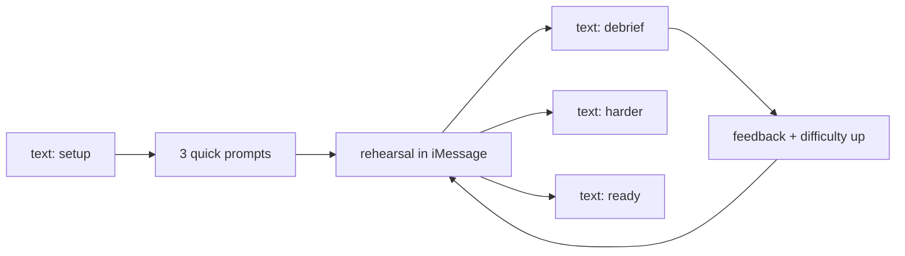
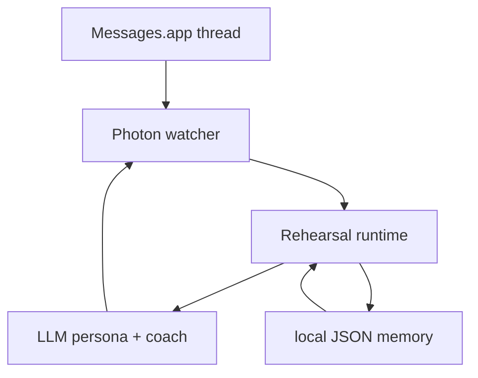

# Rehearsal

**Text an agent. Practice the conversation you've been dreading. It gets harder every time until you're ready to have it for real.**

Built on [Photon iMessage Kit](https://github.com/photon-hq/imessage-kit) for the Photon residency application.

## The Thesis

Hard conversations do not happen on websites. They happen in iMessage.

So the practice should too.

You text one thread, tell it who you need to talk to and what the conversation is about, and it becomes that person: boss, partner, parent, ex, landlord. You rehearse in the same medium where the real conversation is likely to happen.

This prototype runs in a configured local Messages thread on a Mac. A hosted phone-number version would use Photon’s `advanced-imessage` stack instead.

## How It Works



### Commands

Send these in the configured Messages thread:

```text
setup
debrief
harder
ready
status
reset
```

Fast path:

```text
/new boss | ask for a raise after a rough quarter | leave with a concrete next step
```

## Product Shape

- `setup` asks:
  1. who this person is to you
  2. what the conversation is about
  3. what outcome you want
- Then the thread becomes them.
- `debrief` returns:
  - what landed
  - where you lost leverage
  - one better opener
- `harder` escalates resistance.
- `ready` jumps straight to full intensity.
- Memory persists locally across rehearsals in one thread.

## Why This Surface

- No app to download
- No interface to learn
- No mode switch from practice to reality

The medium is part of the product.

## Architecture



## Built With

- Photon `IMessageSDK`
- Photon `startWatching()` for inbound events
- Photon `sdk.message(msg).replyText(...).execute()` for thread-native replies
- Photon `listChats()` for thread discovery
- Local JSON state for rehearsal memory per chat
- OpenAI Responses API for persona turns and debriefs

## Local Setup

1. Give your terminal or IDE **Full Disk Access** on macOS.
2. Install dependencies:

   ```bash
   npm install
   ```

3. Find the chat you want to use:

   ```bash
   npm run list-chats
   ```

4. Create `.env` from `.env.example` and set:
   - `OPENAI_API_KEY`
   - `PRACTICE_CHAT_ID`
   - optionally `OPENAI_MODEL`

5. Start the agent:

   ```bash
   npm run dev
   ```

Recommended thread: a self-chat or a spare Apple ID / number you control.

## Repo Status

- Runtime: `src/index.ts`
- Core loop: `src/runtime.ts`
- Config: `src/config.ts`
- Example env: `.env.example`

Build, typecheck, and tests pass locally. Live smoke test in Messages still depends on your local credentials, Full Disk Access, and target thread.

## Why Me

I’m building [Couch](https://trycouch.app), where psychology students rehearse sessions with virtual patients that remember, resist, and respond.

Rehearsal is the same engine in a tighter surface:

- Couch is an app.
- Rehearsal is an iMessage thread.

That difference matters.
